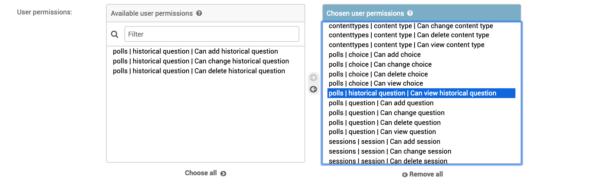
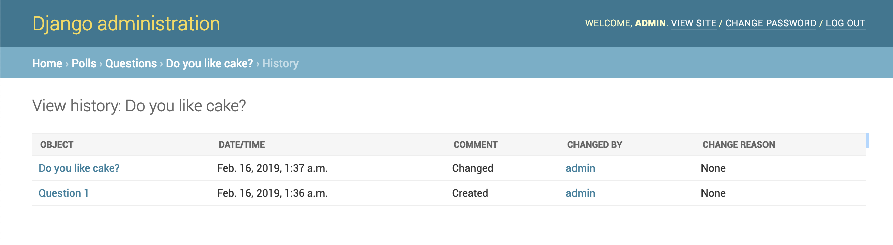
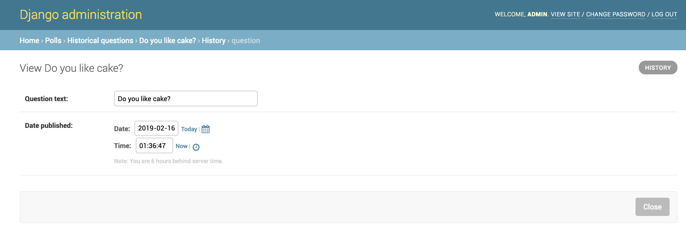

Admin Integration
-----------------

To allow viewing previous model versions on the Django admin site, inherit from
the ``simple_history.admin.SimpleHistoryAdmin`` class when registering your
model with the admin site.

This will replace the history object page on the admin site and allow viewing
and reverting to previous model versions.  Changes made in admin change forms
will also accurately note the user who made the change.

.. image:: screens/1_poll_history.png

Clicking on an object presents the option to revert to that version of the object.

.. image:: screens/2_revert.png

(The object is reverted to the selected state)

.. image:: screens/3_poll_reverted.png

Reversions like this are added to the history.

.. image:: screens/4_history_after_poll_reverted.png

An example of admin integration for the ``Poll`` and ``Choice`` models:

.. code-block:: python

    from django.contrib import admin
    from simple_history.admin import SimpleHistoryAdmin
    from .models import Poll, Choice

    admin.site.register(Poll, SimpleHistoryAdmin)
    admin.site.register(Choice, SimpleHistoryAdmin)

Changing a history-tracked model from the admin interface will automatically record the user who made the change (see :doc:`/user_tracking`).

Displaying custom columns in the admin history list view
~~~~~~~~~~~~~~~~~~~~~~~~~~~~~~~~~~~~~~~~~~~~~~~~~~~~~~~~

By default, the history log displays one line per change containing

* a link to the detail of the object at that point in time
* the date and time the object was changed
* a comment corresponding to the change
* the author of the change

You can add other columns (for example the object's status to see
how it evolved) by adding a ``history_list_display`` array of fields to the
admin class

.. code-block:: python

    from django.contrib import admin
    from simple_history.admin import SimpleHistoryAdmin
    from .models import Poll, Choice

    class PollHistoryAdmin(SimpleHistoryAdmin):
        list_display = ["id", "name", "status"]
        history_list_display = ["status"]
        search_fields = ['name', 'user__username']

    admin.site.register(Poll, PollHistoryAdmin)
    admin.site.register(Choice, SimpleHistoryAdmin)

.. image:: screens/5_history_list_display.png

Permissions
~~~~~~~~~~~

This feature is disabled by default. To enable, use ``django`` 2.1 or greater and add the following to your ``settings`` file:

.. code-block:: python

    SIMPLE_HISTORY_PERMISSIONS_ENABLED = True

Using Django's simple permissions system, you can assign historical model permission to specific users and groups of users in the same way as you do for other models.

If you are using ``Django 2.1`` or greater, the new ``view`` permission is particularly useful. Suppose you want to configure a user to have ``(`view`, `add`, `change`, `delete`)`` permissions for model ``Question``
but do not want the user to be able to use the history of ``Question`` to revert back to a previous instance as described above.
The solution is to assign only the ``view`` permission to the user for the historical model of ``Question``.

In doing this the user can still view the history for ``Question`` ...

but can no longer revert to a previous instance because the revert button has been removed.

Disable Revert
~~~~~~~~~~~~~~

By default, a user with ``change`` permission may revert a model instance to a previous version in the history. To disable the revert feature globally (except for  a ``superuser``) add the following to your ``settings`` file:

.. code-block:: python

    SIMPLE_HISTORY_REVERT_DISABLED = True

