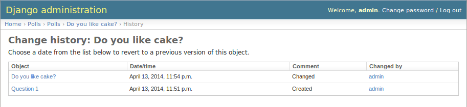
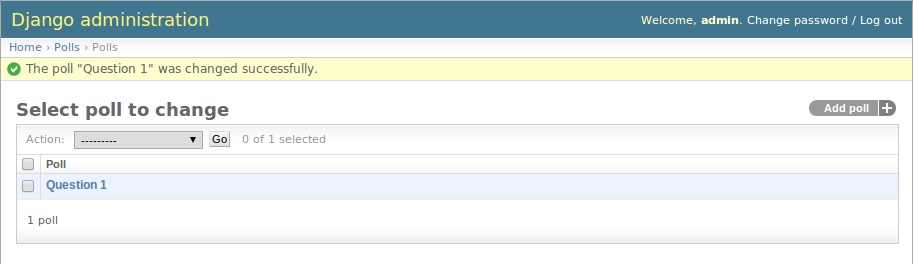
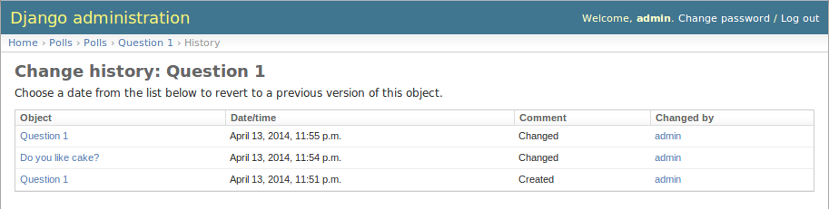
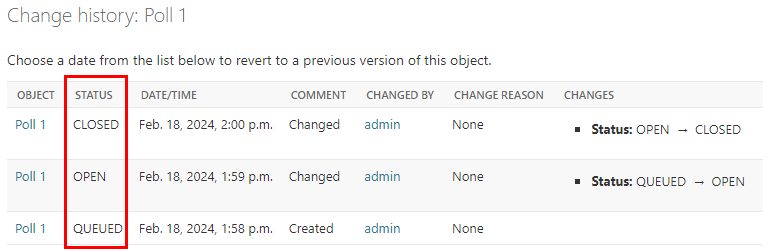
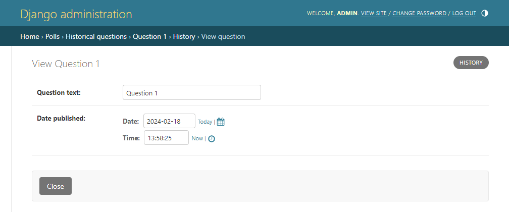

Admin Integration
-----------------

To allow viewing previous model versions on the Django admin site, inherit from
the ``simple_history.admin.SimpleHistoryAdmin`` class when registering your
model with the admin site.

This will replace the history object page on the admin site and allow viewing
and reverting to previous model versions.  Changes made in admin change forms
will also accurately note the user who made the change.

Clicking on an object presents the option to revert to that version of the object.

.. image:: screens/2_revert.png

(The object is reverted to the selected state)

Reversions like this are added to the history.

An example of admin integration for the ``Poll`` and ``Choice`` models:

.. code-block:: python

    from django.contrib import admin
    from simple_history.admin import SimpleHistoryAdmin
    from .models import Poll, Choice

    admin.site.register(Poll, SimpleHistoryAdmin)
    admin.site.register(Choice, SimpleHistoryAdmin)

Changing a history-tracked model from the admin interface will automatically record the user who made the change (see :doc:`/user_tracking`).

Displaying custom columns in the admin history list view
~~~~~~~~~~~~~~~~~~~~~~~~~~~~~~~~~~~~~~~~~~~~~~~~~~~~~~~~

By default, the history log displays one line per change containing

* a link to the detail of the object at that point in time
* the date and time the object was changed
* a comment corresponding to the change
* the author of the change

You can add other columns (for example the object's status to see
how it evolved) by adding a ``history_list_display`` array of fields to the
admin class

.. code-block:: python

    from django.contrib import admin
    from simple_history.admin import SimpleHistoryAdmin
    from .models import Poll, Choice

    class PollHistoryAdmin(SimpleHistoryAdmin):
        list_display = ["id", "name", "status"]
        history_list_display = ["status"]
        search_fields = ['name', 'user__username']

    admin.site.register(Poll, PollHistoryAdmin)
    admin.site.register(Choice, SimpleHistoryAdmin)

Disabling the option to revert an object
~~~~~~~~~~~~~~~~~~~~~~~~~~~~~~~~~~~~~~~~

By default, an object can be reverted to its previous version. To disable this option update your settings with the following:

.. code-block:: python

    SIMPLE_HISTORY_REVERT_DISABLED=True

When ``SIMPLE_HISTORY_REVERT_DISABLED`` is set to ``True``, the revert button is removed from the form.

